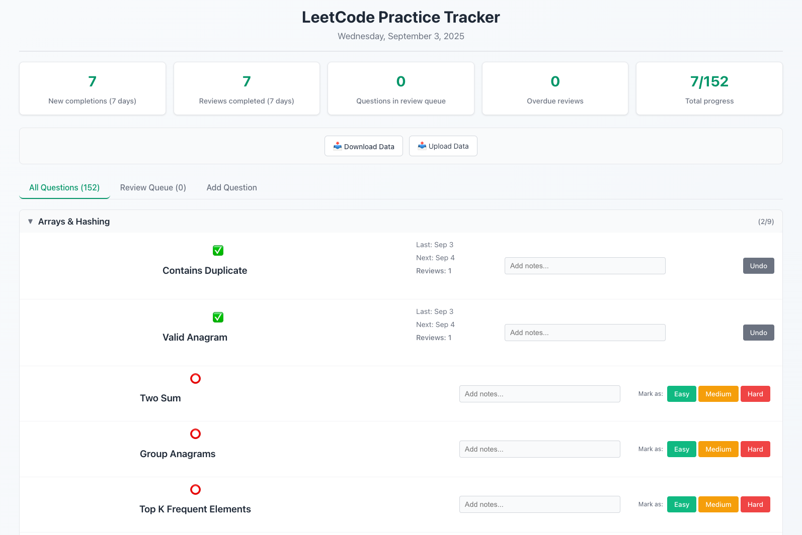

# LeetCode Tracker

A TypeScript-based web application to track LeetCode practice progress with spaced repetition for optimal review scheduling.

(100% written by Claude 🤖)



## Features

- **Question Management**: Track progress on NeetCode 150 and custom questions
- **Spaced Repetition**: Intelligent review scheduling based on performance
- **Progress Tracking**: Visual indicators for completion status and review schedules
- **Dashboard**: Overview of stats, review queue, and question list
- **CSV Storage**: Simple file-based persistence

## Tech Stack

- **Frontend**: React + TypeScript + Vite
- **Backend**: Node.js + Fastify + TypeScript
- **Storage**: CSV files
- **Development**: Hot reload, TypeScript checking, ESLint

## Quick Start

1. **Install dependencies:**
   ```bash
   npm install
   cd backend && npm install
   ```

2. **Start development servers:**
   ```bash
   npm run dev:full
   ```
   This starts both frontend (http://localhost:5173) and backend (http://localhost:3001)

3. **Build for production:**
   ```bash
   npm run build:full
   ```

## Project Structure

```
├── src/                    # React frontend
│   ├── components/         # UI components
│   ├── services/          # API client
│   └── types/             # TypeScript types
├── backend/               # Node.js API server
│   ├── src/
│   │   ├── routes/        # API endpoints
│   │   ├── services/      # Business logic
│   │   └── utils/         # Spaced repetition algorithm
│   └── data/              # CSV data files
└── public/                # Static assets
```

## Spaced Repetition Algorithm

Questions are reviewed on an increasing interval:
- Initial: 1 day → 3 days → 7 days → 14 days → 30 days → 60 days → 90 days
- Reset to 1 day if marked as "struggled" during review
